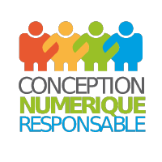

   
    

# Les bonnes pratiques d'écoconception pour WordPress

**Accéder au site**

| Version   | Date     |
| :-------- | :------- |
| version 1 | oct 2022 |

## Pourquoi ce projet en plus des [115 bonnes pratiques web](https://github.com/cnumr/best-practices) ?

**WordPress alimente plus d'un tier du web, 43% en octobre 2022 !**

Pourquoi ? Simple d'installation avec de nombreux ajouts (extensions) possibles et une grande personnalisation sans pour autant avoir strictement besoin de connaître le fonctionnement d'un serveur ou celui d'une base de données ou même les bases du `Html` et du `CSS` en font ses points forts.

Même pour les professionnels du web, WordPress représente un gain de temps important de développement, une maintenance facile, une prise en main rapide pour le client avec une grande autonomie pour un budget moindre qu'un développement sur-mesure.

Malheureusement, WordPress a aussi ses points noirs voulant être une solution qui répond aux besoins de tous. Il peut rapidement devenir obèse avec un impact environnemental important où une vigilance particulière et adaptée à ce CMS en termes d'écoconception, que nous vous proposons via ce référentiel, doit lui être portée pour réduire au mieux son emprunte environnementale.

_Source : [W3Techs](https://w3techs.com/technologies/history_overview/content_management/all)_

## À qui s'adressent les Bonnes Pratiques (BP) WordPress ?

Nous avons conçu ces BP en ayant les différents profils d'utilisateur, en ce sens ce référentiel s'adresse aussi bien à **Madame et Monsieur tout le monde qu'aux designers ou développeuses et développeurs**. Pour ce faire, sur certaines BP vous trouverez différents niveaux de solutions proposées en fonction de votre appétence pour le code.

## Le projet

TODO

## Les besoins

Étant donné les évolutions continues du web, ce référentiel a besoin de régulièrement être mis à jour.
Toute proposition ou idée d'amélioration, de modification ou de suppression est bienvenue.

## Comment contribuer ?

N'hésitez pas à lire [le guide des contributeurs](CONTRIBUTING.md).

## La liste des Bonnes Pratiques

> [!IMPORTANT]
>
> - [Dossier contenant les fiches de bonnes pratiques](src/content/fiches/fr/) ;
> - [Dossier contenant le lexique](src/content/lexique/fr/) ;
> - [Dossier contenant les personas](src/content/personas/fr/).

## Licence

Les sources et contenus de ce projet sont [protégés](LICENCE.md)
