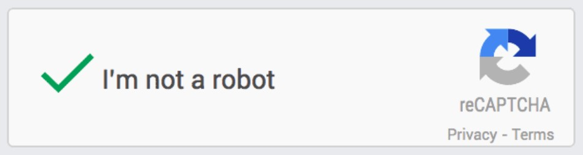
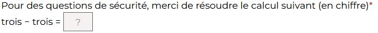

## Sujet
En supplément de la [sécurité globale de votre installation WordPress](#TODO) et pour reprendre les indications de la fiche [Limiter la quantité de données transmise par les formulaires en ligne](/fiches/34. Limiter la quantité de données transmise par les formulaires en ligne.md), il est indispensable de limiter le poids de votre base de données et/ou de limiter le nombre d'emails envoyés depuis vos formulaires en ligne.
Que vous ayez choisi de stocker les données des formulaires dans votre base de données ou de les transmettre par email, les formulaires doivent être sécurisés afin de ne pas permettre aux robots d'envoyer des spams via les formulaires présents sur votre site.

Il existe plusieurs méthodes pour sécuriser les formulaires en lignes : le captcha ou le pot de miel (HoneyPot)
### Le captcha <sup>1</sup>
Le captcha est un système qui permet de vérifier, par une suite de lettres, un calcul, la reconnaissance d'images, etc. que le formulaire en ligne est bien rempli par un être humain.

#### Google reCAPTCHA
reCAPTCHA est un système de détection automatisée d'utilisateurs appartenant à Google et mettant à profit les capacités de reconnaissance de ces derniers, mobilisées par les tests CAPTCHA, pour améliorer par la même occasion le processus de reconnaissance des formes par les robots<sup>2</sup>.
Il en existe de plusieurs types (reconnaissances d'images, de textes, validation automatique par Google).

#### Captcha personnalisé
Vous pouvez ne pas utiliser Google reCAPTCHA, et créer vos propres questions/réponses ou questions mathématiques.

### Le Pot de miel
La méthode pot de miel est efficace pour éviter les Spams. Un champs est ajouté dans le code du site, mais non visible pour les utilisateurs. Ainsi, s'il est rempli, c'est que l'utilisateur est un robot.

## GreenIT vous conseille
- Choisir une extension de gestion des formulaires qui intègre au moins une des méthodes ci-dessus
- Veiller à ce que tous les utilisateurs puissent valider la méthode choisie
- Nettoyer vos données lorsque la méthode choisie n'a pas été efficace (ce qui peut toujours arriver)

> La methode Google reCaptcha n'est pas celle la plus recommandée parce qu'elle fait un appel des fichiers sources externe qui sont lourdes. De plus, elle n'est pas utilisable par l'ensemble des utilisateurs.

## Exemple
Google reCAPTCHA


Captcha personnalisé accessible


Pot de miel accessible
Ici le pot de miel est un bouton radio invisible pour n'importe quel utilisateur humain. Voici la structure HTML du champs. Il faut lui ajouter une vérification logique dans lors de la validation du formulaire.
```
<label for="infosupp" aria-hidden="true" class="visually-hidden">infosupp <input type="radio" name="infosupp" id="infosupp" style="display:none" value="1"></label>
```

## Principe de validation

| Le nombre | est inférieur ou égal à |
| ------------- | :---------------------: |
| de formulaires non sécurisés        |            0            |

## Sources
- Note 1 : https://fr.wikipedia.org/wiki/CAPTCHA
- Note 2 : https://fr.wikipedia.org/wiki/ReCAPTCHA
