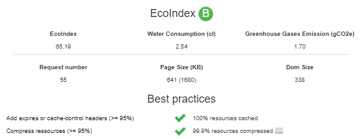

## Sujet

Toute page consultée sur un site WordPress est générée par le système. Afin de réduire la consommation de ressources matérielles et flux réseau, il est recommandé de mettre en place un système de cache.

Le cache existe à différents niveaux. Il existe un cache sur votre navigateur Internet. Mais il est aussi possible de mettre en cache système WordPress. Ainsi, si la page, ou l'article appelé n'a pas été modifié depuis la dernière mise en cache, elle sera délivrée sans nouvel appel aux fonctions profondes de WordPress.

## GreenIT vous conseille

### Solution no-code 🌱🌱🌱

La création d'un cache sur WordPress peut être réalisée via l'utilisation d'une [[extension]] spécifique apportant de nombreuses possibilités.

Il existe de nombreuses extensions d'optimisation et de cache, chacune ayant des fonctions particulières (<https://fr.wordpress.org/plugins/tags/cache/>). Selon l'hébergeur, la version de WordPress installée, elles n'auront pas les mêmes effets. Ainsi il n'est pas possible de vous proposer une en particulier, et il est recommandé d'en tester des différentes afin d'optimiser le résultat.

### Solution code 🌱🌱🌱

Il est possible d'activer le cache de Wordpress par l'ajout d'un paramètre dans le fichier `wp-config.php` qui se trouve en racine de votre site.
Le paramètre à insérer est :
`define('WP_CACHE', true);`

## Exemple

Nous avons testé différentes extensions.
Les meilleurs résultats nous ont permis de gagner 1 niveau et de réduire drastiquement les erreurs signalées dans l'outil GreenIT Analysis disponible sur [Firefox](https://addons.mozilla.org/fr/firefox/addon/greenit-analysis/) et [Chrome](https://chrome.google.com/webstore/detail/greenit-analysis/mofbfhffeklkbebfclfaiifefjflcpad?hl=fr).

## Principe de validation

| Le nombre                        | est inférieur ou égal à |
| -------------------------------- | :---------------------: |
| de ressources non mises en cache |           0%            |
